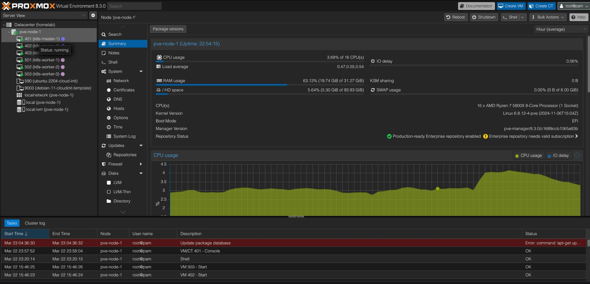
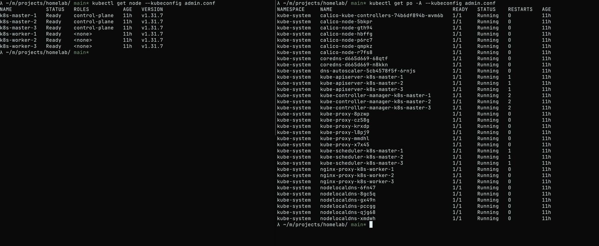

# Homelab kubernetes cluster




### Prerequisites
1. proxmox installed on a server

### Steps
## 1. create a vm template on proxmox

in your proxmox server
```sh 

sudo apt update -y && sudo apt install libguestfs-tools -y
wget https://cloud.debian.org/images/cloud/bullseye/latest/debian-11-generic-amd64.qcow2

```
install qemu-guest-agent on the vm template

```sh 

virt-customize -a debian-11-generic-amd64.qcow2 --install qemu-guest-agent

```
create the template

```sh
qm create 9003 --name "debian-11-cloudinit-template" --memory 2048 --cores 2 --net0 virtio,bridge=vmbr0
qm importdisk 9003 debian-11-generic-amd64.qcow2 local-lvm
qm set 9003 --scsihw virtio-scsi-pci --scsi0 local-lvm:vm-9003-disk-0
qm set 9003 --boot c --bootdisk scsi0
qm set 9003 --ide2 local-lvm:cloudinit
qm set 9003 --serial0 socket --vga serial0
qm set 9003 --agent enabled=1

qm template 9003
```

## 2. create role and user for terraform

# Create Role

```sh
pveum role add terraform_role -privs "Datastore.AllocateSpace Datastore.Audit Pool.Allocate Sys.Audit Sys.Console Sys.Modify VM.Allocate VM.Audit VM.Clone VM.Config.CDROM VM.Config.Cloudinit VM.Config.CPU VM.Config.Disk VM.Config.HWType VM.Config.Memory VM.Config.Network VM.Config.Options VM.Migrate VM.Monitor VM.PowerMgmt"
# Create User
pveum user add terraform_user@pve --password secure1234
# Map Role to User
pveum aclmod / -user terraform_user@pve -role terraform_role
```

```sh
export PM_USER="user@pve"
export PM_PASS="secure1234"

```
create the terraform.tfvars file change it for you configuration ip
```
# Global parameters
target_node = "pve-node-1"
bridge_network = "vmbr0"
bridge_cidr_range = "192.168.1.0/24"
ciuser = "debian"
ssh_keys = ""

# Control plane nodes parameters
master_nr = 3
master_id_range = 400
master_network_range = 60 # It will be used as X.X.X.100, X.X.X.101...
master_naming = "k8s-master"
master_cores = 2
master_sockets = 1
master_memory = 4096
master_disksize = "20G"

# Worker nodes parameters
worker_nr = 3
worker_id_range = 500
worker_network_range = 70 # It will be used as X.X.X.200, X.X.X.201...
worker_naming = "k8s-worker"
worker_cores = 1
worker_sockets = 1
worker_memory = 2048
worker_disksize = "20G"

```

## 3. run

```sh
terraform init
terraform plan --var-file=terraform.tfvars
terraform apply --var-file=terraform.tfvars

```
after this the terraform will create an inventory.ini with this format

```
# This inventory describe a HA typology with stacked etcd (== same nodes as control plane)
# and 3 worker nodes
# See https://docs.ansible.com/ansible/latest/inventory_guide/intro_inventory.html
# for tips on building your # inventory

# Configure 'ip' variable to bind kubernetes services on a different ip than the default iface
# We should set etcd_member_name for etcd cluster. The node that are not etcd members do not need to set the value,
# or can set the empty string value.
[kube_control_plane]
# node1 ansible_host=95.54.0.12  # ip=10.3.0.1 etcd_member_name=etcd1
# node2 ansible_host=95.54.0.13  # ip=10.3.0.2 etcd_member_name=etcd2
# node3 ansible_host=95.54.0.14  # ip=10.3.0.3 etcd_member_name=etcd3

[etcd:children]
kube_control_plane

[kube_node]
# node4 ansible_host=95.54.0.15  # ip=10.3.0.4
# node5 ansible_host=95.54.0.16  # ip=10.3.0.5
# node6 ansible_host=95.54.0.17  # ip=10.3.0.6
```


### Deploy kubernetes

```sh
git submodule update --init --recursive
# or clone the kubespray git clone git@github.com:kubernetes-sigs/kubespray.git
cd kubespray
git ceckout release-2.27

cp -rfp inventory/sample inventory/mycluster

```
copy the inventory.ini that was created by terraform to the inventory/mycluster/inventory.ini

```sh
ansible-playbook -i inventory/cluster/inventory.ini  -b cluster.yml
```

